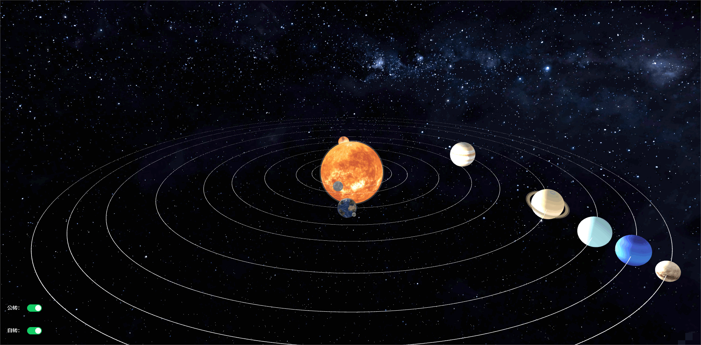
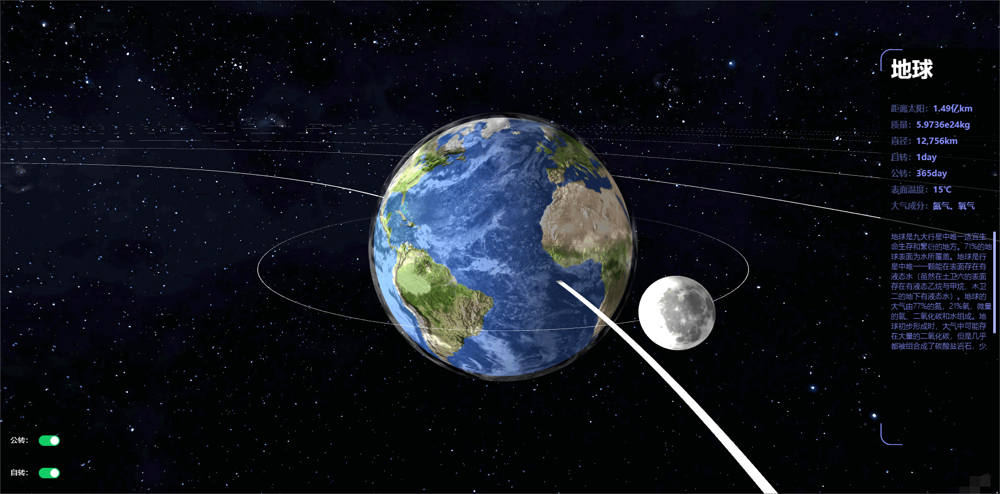

# threeJs太阳系
* 浏览链接：http://xisite.top/original/three-solarsystem/index.html
* 项目链接：https://gitee.com/xi1213/three-solarsystem
* scdn文章：https://blog.csdn.net/xi1213/article/details/125726054
# 项目简介
* three.js模拟太阳系运行。
* 具有行星自转、公转效果。
* 双击行星可拉近查看。
* 行星点击后会弹出相关文字描述。
# 相关技术
* vue2主体框架。
* three.js绘制3d图形。
# 项目使用
* 安装依赖：npm install
* 项目运行：npm run serve
* 项目打包：npm run build
# 详情说明
* 双击空白可暂停或开启行星自转、公转。
* 点击左下角开关可控制行星自转、公转。

* 双击行星可拉经查看行星与对应的描述文字。
